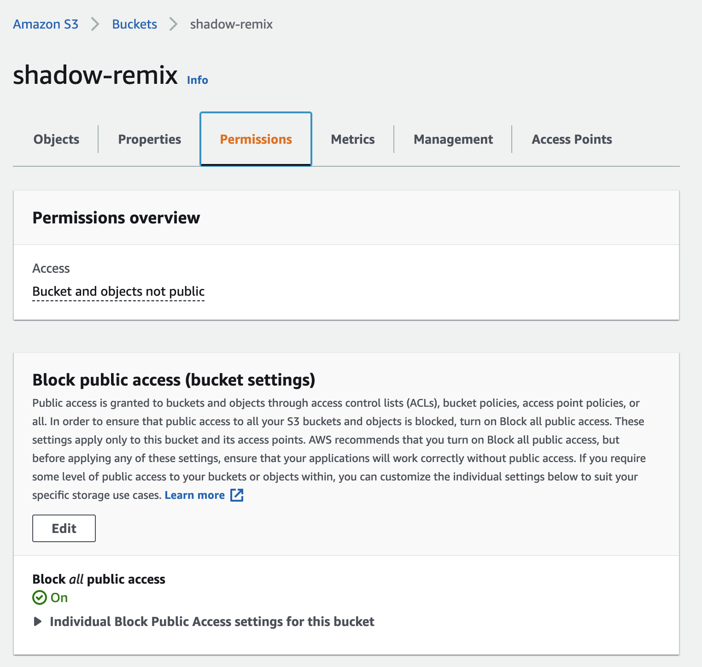

# Backend Setup

- [AWS S3](#aws-s3)
  - [Create S3 Bucket](#create-s3-bucket)
  - [Enable Read Only Access](#enable-read-only-access)
  - [Enable Cross Origin Requests](#enable-cross-origin-requests)
  - [Setup AWS Credentials](#setup-aws-credentials)
- [Recompile Desktop App](#recompile-desktop-app)
- [Hosting Private Admin Server](#hosting-private-admin-server)


## AWS S3

S3, or Simple Storage Service, is a cloud storage service provided by Amazon Web Services (AWS). Using S3, you can host any number of files while paying for only what you use. To give you an idea of how much you will pay with this service, see the [AWS pricing page](https://aws.amazon.com/s3/pricing/):

- Storage: **$0.026 per GB**: for 10,000 250MB images, that's 7 cents per month.
- Upload: **0.0055 per 1,000 POST requests**: there is a request when the image is uploaded and another when the image is approved by an admin totalling 6 cents for 10,000 images.
- Download: **$0.09 per GB + $0.00044 per 1000 GET requests**: anytime someone views the gallery and looks at images, they are technically downloading data from AWS.  For 10,000 250MB images viewed online per month, that's 23 cents per month.
- Requests: **$0.0055 per 1000 LIST requests**:  Each time you ask the server for to refresh the gallery, you are charged for a LIST request  Refreshed once every 10 seconds, that's 8640 requests a day or $1.43 a month.  This is high enough that it makes sense to turn off this feature for a publicly available gallery website, and only have the live reloading happening in the museum setting.

This app uses an AWS S3 bucket to store saved images in the cloud.  To get started you will first need to create an AWS account at [aws.amazon.com](https://aws.amazon.com/).

### Create S3 Bucket

Once signed in search for **S3**.  You should end up at something called the S3 Console, currently located at [s3.console.aws.amazon.com/s3/](https://s3.console.aws.amazon.com/s3/):


Click the button labelled `Create Bucket`:


Give your bucket a name and set the region to somewhere geographically close to you, I'm using `US West (N. California) us-west-1`.


Leave the remaining default settings in place and click **Create Bucket**.

### Enable Read Only Access

Select your bucket and go to the **Permissions** tab.  The default settings should say **Block public access**.  Click the **Edit** button:



Deselect the checkbox to allow public access to your bucket. This will make all files inside your bucket publicly accessible over the internet.  Be sure not to upload any sensitive information to your bucket.


Click **Save Changes** and confirm that you would like to allow public access to the bucket.

Under **Bucket Policy** click **Edit**:


Paste the following in to the Bucket policy editor to allow read-only access to bucket contents:

```json
{
    "Version": "2012-10-17",
    "Statement": [
        {
            "Sid": "PublicReadGetObject",
            "Effect": "Allow",
            "Principal": "*",
            "Action": [
                "s3:GetObject",
                "s3:ListBucket"
            ],
            "Resource": [
                "arn:aws:s3:::Bucket-Name"
                "arn:aws:s3:::Bucket-Name/*"
            ]
        }
    ]
}
```

Be sure to edit the lines `arn:aws:s3:::Bucket-Name` and `arn:aws:s3:::Bucket-Name/*` to include your bucket name, I'm using `arn:aws:s3:::shadow-remix` for my bucket named `shadow-remix`


Click **Save Changes**.

### Enable Cross Origin Requests

Scrolling down further in your bucket's **Permissions** tab, find the **Cross-origin resource sharing (CORS)** section:


Click **Edit** and paste in the following:
```
[
    {
        "AllowedHeaders": [
            "*"
        ],
        "AllowedMethods": [
            "PUT",
            "GET",
            "HEAD"
        ],
        "AllowedOrigins": [
            PUT YOUR DOMAIN HERE!, e.g: "https://mydomain.com"
        ],
        "ExposeHeaders": [
            "x-amz-meta-date",
            "x-amz-meta-width",
            "x-amz-meta-height",
            "x-amz-meta-featured",
            "x-amz-meta-approved",
            "x-amz-meta-author",
            "x-amz-meta-motor-angle-1",
            "x-amz-meta-motor-angle-2",
            "x-amz-meta-station-id"
        ]
    }
]
```
You will need to update `AllowedOrigins` to contain the domain(s) where you plan to host your public image gallery and admin gallery interface (remove the comments as well).  You may leave the `AllowedOrigins` as an empty array if needed.

Click **Save Changes**.  This will allow the gallery website to access images in this bucket.


### Setup AWS Credentials

In order to upload images to AWS, we need to generate AWS Security Key Access Credentials first.  Search for Identity and Access Management (IAM) to get to the IAM dashboard, currently located at [console.aws.amazon.com/iamv2/home](console.aws.amazon.com/iamv2/home):


In the left menu, click on **Policies** and click the **Create Policy** button:


Click **Choose a Service** and select **S3** and add the following access permissions (under **Actions**):

- Write -> putObject


Under **Resources** add the ARN for the S3 bucket you just created so the write permissions are restricted to your bucket.  Click **Add ARN** then type in your bucket name and select Any for **Object name**:


Click **Add** to add ARN.

Click **Next** until you get to the **Review Policy** step.  Give the policy a name then click **Create Policy**.  I called my policy `shadow-remix-write-objects-policy`.

Next we need to create a user to give the shadow remix desktop app access to write to our bucket.  Click on **Users** in the left menu in the IAM dashboard then select **Add users**


Give the user a name and select **Access key** for programmatic access:


Next click **Attach existing policies directly** and select the policy you just created:


Click **Next** until you get to the **Review** step, then click **Create User**.  Once created, AWS will show you a screen with your access key and a secret access key.  Download this repository from Github, then create a file called `.env` in the root of the repository (the same folder where `README.md` is located), the file structure of the repository should look like this:

```
Shadow-Remix/
    arduino/
    docs/
    ....
    app/
    .env
    .gitignore
    README.md
```

Edit the `.env` file and paste in the name, region, key, and secret key for your AWS setup:

```
AWS_BUCKET_NAME=shadow-remix
AWS_BUCKET_REGION=us-west-1
AWS_ACCESS_KEY=XXXXXXXXXXXXXXXXXXXXX
AWS_SECRET_KEY=XXXXXXXXXXXXXXXXXXXXXXXXXXXXX
```

**Be careful with your secret access key, never commit it to git or share it with anyone!**  By default I've added .env files to the [.gitignore](../.gitignore), so they should not be added to git.


## Recompile Desktop App

Now that you've set up AWS and created a `.env` file, you need to recompile your desktop app so that it can use your keys and upload images to the AWS bucket.  Follow the steps outlined in the main README for [Compiling Desktop App](../README.md#compiling-desktop-app).


## Hosting a Public Image Gallery

Follow the steps outlined in the main README for [Compiling Gallery](../README.md#compiling-gallery) to recompile the image gallery app.  After recompiling, the contents of `gallery/dist/` can be hosted online to provide a publicly accessible gallery view of your database.  Be sure to add the domain where your gallery is hosted to the list of [cross origin "AllowedOrigins"](#enable-cross-origin-requests).


## Hosting the Shadow Remix Web App

The contents of [app/dist][app/dist] can be hosted online to provide a publicly accessible version of the shadow remix web app.  The web app will does not communicate with the server, so it does not need to be recompiled with your keys.  We are also hosting a version at []().## TODO: add link.


## Hosting Private Admin Server

Follow the steps outlined in the main README for [Compiling Gallery](../README.md#compiling-gallery) to recompile the gallery admin app.  Be sure to add the domain where your admin interface will be hosted to the list of [cross origin "AllowedOrigins"](#enable-cross-origin-requests).  Because the admin gallery interface contains the private keys for accessing your AWS bucket, you **MUST** put this site behind a password in order to serve it safely.

These next steps will show you how to host a private admin server for approving new images submitted to the gallery.  This is optional, you could run the gallery admin server locally instead, but it may be easier for others on you team to access if it is hosted online.  The following steps will guide you through the process of setting this up on AWS using a combination of a few services: [S3](https://aws.amazon.com/s3/), [Cloudfront](https://aws.amazon.com/cloudfront/), and [Lambda](https://docs.aws.amazon.com/lambda/latest/dg/welcome.html).

[Create an S3 bucket](#create-s3-bucket), name it (I named mine "gallery-admin"), and set the permissions to block public access:


For testing, upload the contents of [app/dist/](app/dist) to your bucket (we will replace this with the admin interface later).

Search for **Cloudfront** in AWS and navigate to the Cloudfront dashboard:


In the **Cloudfront** dashboard, click **Create Distribution**:


Edit the origin domain to point to your private bucket:


Leave the remaining settings as they are and click **Create Distribution**.  It will take a few minutes for your distribution to be deployed; the status in the Cloudfront dashboard will read **In Progress** until then.  Anytime you make a change to Lambda or Cloudfront, you will need to wait for the Cloudfront distribution status to read **Deployed** before testing.

Now search for **Lambda** in AWS:


In the **Lambda** dashboard, click **Create Function**:


Give your function a name (I named mine "shadow-remix-admin-password") and set the **Default Execution Role** to **Create a new role from AWS policy templates** then give the role a name and select **Basic Lambda@Edge permissions (for Cloudfront trigger)**:


Finally, click **Create Function**.

Paste the following code into the Lambda function (update `authUser` and `authPass`):

```js
'use strict';
exports.handler = (event, context, callback) => {

    // Get request and request headers
    const request = event.Records[0].cf.request;
    const headers = request.headers;

    // Configure authentication
    const authUser = 'user';
    const authPass = 'pass';

    // Construct the Basic Auth string
    const authString = 'Basic ' + new Buffer(authUser + ':' + authPass).toString('base64');

    // Require Basic authentication
    if (typeof headers.authorization == 'undefined' || headers.authorization[0].value != authString) {
        const body = 'Unauthorized';
        const response = {
            status: '401',
            statusDescription: 'Unauthorized',
            body: body,
            headers: {
                'www-authenticate': [{key: 'WWW-Authenticate', value:'Basic'}]
            },
        };
        callback(null, response);
    }

    // Continue request processing if authentication passed
    callback(null, request);
};
```


Click **File>Save**.  Go to the **Versions**** tab and click **Publish New Version**:


At the top of the page, select **Actions>Deploy to Lambda@Edge**.  Select the Cloudfront distribution that you just set up, set the **Cloudfront event** to **Viewer request**, select **include body** and **Confirm deploy to Lambda@Edge**, then select **Deploy**.


If you navigate back to the **Cloudfront** dashboard, you will see your Cloudfront Distribution has changed back to **In Progress**.  Wait for it to change to **Deployed**.  Click on the Cloudfront distribution and copy the **Distribution domain name**:


Paste this into your browser, followed with index.html.  You should see a username and password prompt:


Enter your username and password, then you should see the shadow remix app load up.  If that is all working correctly, delete everything from your gallery-admin **S3** bucket and replace with the contents of `gallery-admin/dist/`.

Refresh the page in your browser.  If you do not see your gallery images loading up, add the Cloudfront Distribution domain from above to the list of [cross origin "AllowedOrigins"](#enable-cross-origin-requests).