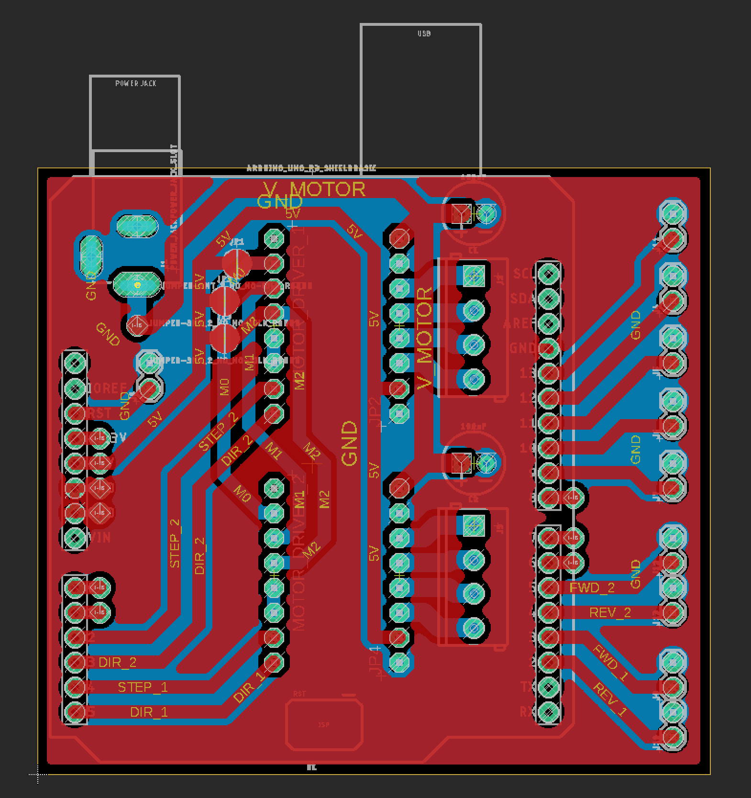

# Printed Circuit Boards

This repo also includes design files for a CNC machined PCB that plugs directly into an Arduino, supports up to two motor drivers, and includes screw terminals for connecting to all switches/motors in the shadow remix station.

## Eagle Files

The PCB was designed in [Eagle](http://eagle.autodesk.com/) using components from the [Sparkfun](https://github.com/sparkfun/SparkFun-Eagle-Libraries) and [Adafruit](https://github.com/adafruit/Adafruit-Eagle-Library) Eagle libraries.  The design files are located in the [pcb](../pcb/) directory.

Features:

- Plugs directly into Arduino
- Up to two stepper motor drivers plug into PCB, supports [DRV8825](https://www.pololu.com/product/2133/pictures#lightbox-picture0J4233) and [A4988](https://www.pololu.com/product/1182/pictures#lightbox-picture0J10073) motor driver pinouts (and possibly others)
- Three solder jumpers to set stepper micro-stepping mode
- Two 100uF capacitors for smoothing power supply
- Unused Arduino IO pins have vias nearby for soldering headers later if needed
- 2.1mm jack for connecting motor power supply

Parts List:

(2x) A4988 Stepper Motor Driver [Amazon](https://www.amazon.com/HiLetgo-Stepstick-Stepper-Printer-Compatible/dp/B07BND65C8/)
(1x) through-hole male header pins 0.1" spacing [Digikey S1011EC-40-ND](https://www.digikey.com/en/products/detail/sullins-connector-solutions/PRPC040SAAN-RC/2775214?s=N4IgTCBcDaIMoEYAMCEFEDCBaALErAcgCIgC6AvkA)  
(4x) through-hole female header pins 0.1" spacing [Digikey S7041-ND](https://www.digikey.com/en/products/detail/sullins-connector-solutions/PPPC081LFBN-RC/810180)  
(2x) 100uF Capacitor [Digikey 1572-1039-ND](https://www.digikey.com/en/products/detail/cornell-dubilier-illinois-capacitor/107CKE025MEM/5343969)  
(1x) 2.1mm jack through-hole [Digikey CP-002A-ND](https://www.digikey.com/en/products/detail/cui-devices/PJ-002A/96962?s=N4IgTCBcDaIMIAUC0AGFYCCSByAREAugL5A)  
(4x) 1x2 3.5mm screw terminal [Pololu 2444](https://www.pololu.com/product/2444)  
(6x) 1x2 0.1" screw terminal [Digikey A98333-ND](https://www.digikey.com/en/products/detail/te-connectivity-amp-connectors/282834-2/1150135?s=N4IgTCBcDaIIIE4AcBmNBaAcgERAXQF8g)  
(2x) 1x4 0.1" screw terminal [Digikey ED10563-ND](https://www.digikey.com/en/products/detail/on-shore-technology-inc/OSTVN04A150/1588864?s=N4IgTCBcDaIKIBECMAGArANgMwFoByCIAugL5A)

## Milling PCB

Tools and Stock:

(1x) 1/64" diameter endmill [Carbide Depot CU 129974](http://www.carbidedepot.com/00156in-DIA-2FL-SE-AlTiN-164-P180142.aspx) - for cutting traces  
(1x) 1/32" dimeter endmill [Carbide Depot SGS 30398](http://www.carbidedepot.com/00312in-DIA-2FL-SE-132-AlTiN-COATED-P23340.aspx) - for cutting holes and board perimeter  
(1x) Double sided PCB blanks [Inventables 24201-06](https://www.inventables.com/technologies/circuit-board-blanks) - be sure to get FR1 blanks and not fiberglass-containing FR4  

In order to prepare the g-code for cutting the PCB, I exported the traces, holes, and board outline as PNG files from Eagle.  I made some changes to the design PNGs in Photoshop - adjustments to the hole sizes and offsets to allow enough clearance for the endmills.  The final PNGs I used are included in the [pcb](../pcb/) directory.  I used [mods.cba.mit.edu](https://mods.cba.mit.edu/) to generate gcode from the PNGs and added those to the [pcb](../pcb/) directory as well.

I used double sided tape to attach the PCB blank to a piece of spoilboard.  I zeroed to the bottom left corner of the stock and cut the holes first (1/32" endmill), then the top traces (1/64" endmill), then the outline (1/32" endmill).

I flipped the board and aligned it to the bottom left corner of the hole in the stock, taping it down again.  Then I re-zeroed the CNC at [-1/32", -1/32"] from the original zero to compensate for the kerf of the 1/32" outline cut.  Finally, I cut the bottom traces  with a 1/64" endmill.

I used PCB rivets to create vias through the larger holes in the PCB design:

(1x) PCB rivets 1mm ID [Botfactory](https://www.botfactory.co/shop/product/pcb-rivets-1mm-40-mil-823?category=7) or [VPC](https://www.vpcinc.com/Category/Favorit-Through-Hole-Rivets-104.cfm)

These rivets are wide enough to let a 0.1" header pin pass through, simplifying the design of the board.  Alternatively, you can use wire to create vias in your PCB, but you will need to adjust the design to move the vias away from where the headers are mounted.  I use a simple center punch and a hammer to press the rivets, rather than the suggested tools (which are quite expensive).  [More info about using PCB rivets for double-sided boards.](https://fab.cba.mit.edu/classes/863.16/doc/tutorials/PCB_Rivets/)  

## Getting PCBs professionally manufactured

If you end up getting this PCB professionally manufactured, make sure that you connect the top and bottom ground planes in the design.  The current design has "GND" and a "GND_TOP" nets to make it work better for PCB milling (the nets end up getting connected by a via when the PCB is populated).  If you change the name of the GND_TOP net to GND and allow Eagle to recalculate the traces, then you should be ok for a more traditional PCB fabrication process.

## Wiring

See wiring diagram below:

